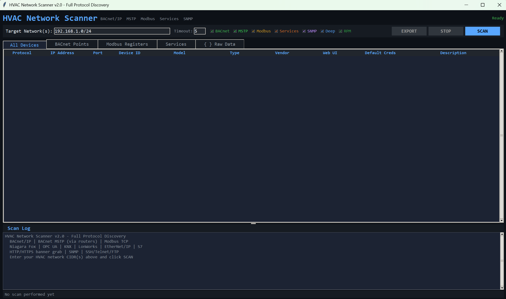

# HVAC Network Scanner

A multi-protocol discovery and audit tool for HVAC and building automation networks. Zero third-party dependencies — everything runs on the Python 3.10+ standard library.

Looking for a Siemens APOGEE P2 scanner or BACnet bridge? See this project [P2Scanner](https://github.com/jamesccupps/P2Scanner)

[](https://github.com/jamesccupps/HVAC-Network-Scanner/actions/workflows/ci.yml)
[](LICENSE)
[](https://www.python.org/downloads/)



## What it does

Scans a network and tells you what building-automation gear lives on it. For each device found it tries to identify the exact model, pull readable points or registers, and surface the factory-default credentials that ship with that product so you can confirm they've been changed.

Works against:

- **BACnet/IP** — raw UDP `Who-Is` / `I-Am`, `ReadProperty`, and `ReadPropertyMultiple`. No BAC0 dependency, works on newer python versions.
- **BACnet MSTP** — device enumeration behind BACnet routers via `Who-Is-Router-To-Network` and targeted `Who-Is` to remote DNETs.
- **Modbus TCP** — port sweep, device identification (FC 43 / MEI 14), holding/input register reads, and coil reads.
- **HVAC services** — Niagara Fox, OPC UA, Siemens S7, EtherNet/IP CIP, KNXnet/IP, LonWorks/IP, MQTT, WebCTRL, Metasys, plus HTTP/HTTPS banner grabs.
- **SNMP v1/v2c** — raw UDP `sysDescr` probe, no pysnmp dependency.

Model identification combines signals from multiple protocols:

- Trane Tracer SC / SC+ / UC600 / UC400
- Siemens Desigo PXC automation stations, Desigo CC, TX-I/O modules
- Johnson Controls FEC / Metasys NAE
- Honeywell / Tridium Niagara
- Schneider EcoStruxure / SmartX
- Contemporary Controls BASRT-B routers
- Carrier i-Vu, Automated Logic WebCTRL, Distech, Delta, KMC, Reliable, Carel, Belimo, Daikin, Mitsubishi, LG, and more

## Tested against (verified hardware)

The scanner has been verified against real hardware in live
installations. These devices have known-good classification profiles:

- **Trane Tracer SC+** — supervisory controller (5,000+ objects)
- **Trane Symbio 400-500** — field controller (MSTP)
- **Trane Tracer Ensemble (TES Workstation)** — supervisor
  (handles RPM rejection via fallback to single ReadProperty)
- **Siemens PXC Compact** (EPXC V3.5.x firmware) — field panel
- **Siemens PXC Modular** (PXME V3.5.x firmware) — field panel
  (verified with 1,960-object HV-1 program)
- **Siemens DXR2.E10PL-1, .E12P-1, .E18-1** — room controllers
- **Siemens Desigo CC / Insight** — supervisors

Across these, the scanner has been tested with ~13,000 points read
and ~30,000 paired BACnet exchanges at zero wire-level errors.

**For hardware not on this list**, the scanner uses a size-based
heuristic that sets an appropriate object enumeration cap from the
device's own reported object count. This is expected to work
correctly for any BACnet-compliant device. If you scan a device that
isn't on this list, please consider [contributing a profile](CONTRIBUTING.md)
so future users can benefit from verified classification.

**Known out-of-scope:**

- Panels running proprietary firmware that doesn't include BACnet/IP.
  For example, Siemens APOGEE PXC panels running firmware revision 2.x
  speak Apogee P2 Ethernet rather than BACnet/IP. These panels may have
  IP addresses and be actively managed by Siemens Desigo CC, but they
  don't answer BACnet/IP. The same hardware upgraded to firmware
  revision 3.x or later would be scannable. If you're affected, check
  with your Siemens representative about a firmware upgrade path — or
  use commercial P2 gateways like PurpleSwift BACnetP2 for integration.
- Proprietary BMS protocols that are not BACnet or Modbus TCP
  (JCI N2, LonTalk, Honeywell C-Bus, various others).

## Install

```bash
git clone https://github.com/jamesccupps/HVAC-Network-Scanner.git
cd HVAC-Network-Scanner
pip install -e .
```

Or run straight from the source tree without installing:

```bash
python -m hvac_scanner           # launches the GUI
python -m hvac_scanner.cli --help
```

Requires Python 3.10 or newer. No extra packages.

## Using the GUI

```bash
python -m hvac_scanner
```

Enter one or more CIDR networks (comma-separated), pick which protocols to scan, click **SCAN**. Devices populate into tabs:

- **All Devices** — cross-protocol table with identified model, vendor, web UI URL, default credentials, and description. Right-click for open-web-UI, copy-IP, copy-creds, ping, and a full details popup.
- **BACnet Points** — per-device object lists with present values and units.
- **Modbus Registers** — holding / input / coil reads.
- **Services** — discovered TCP service ports with banners and page titles.
- **Raw JSON** — the full scan result, ready to copy or export.

Click column headers to sort. IP addresses sort numerically by octet, not lexicographically.

Export to CSV or JSON with the **EXPORT** button.

### Target syntax

The target field and CLI accept any mix of:

```
10.0.0.0/24                       # CIDR
10.0.0.5                          # single host
10.0.0.2-100                      # last-octet range
10.0.0.2-10.0.0.12                # full-IP range
10.0.0.0/30, 10.0.1.5, 10.0.2.1-20  # mixed list
```

The broadcast address for BACnet Who-Is is computed automatically from
whatever you type — narrow CIDRs (e.g. `/26`), ranges, and single hosts
all auto-broadcast to the enclosing `/24`. The scan log shows the chosen
broadcast target so it's never magic. Power users can override via the
`--broadcast` CLI flag or `ScanOptions.bacnet_broadcast`.

## What's new in v2.2

### v2.2.0 (2026-04-20)

- **Classification report export.** New CLI flag
  `--export-classification PATH` and a GUI export option (save as
  `.txt`). Produces a plain-text report of every BACnet device the
  scanner classified, the path it took (known profile vs. vendor
  substring match vs. heuristic vs. default), the cap applied, and
  the observed object count. Designed so users can submit device
  profile contributions on GitHub without the maintainer needing
  physical access to the hardware.
- **Community contribution flow.** CONTRIBUTING.md now documents
  how to submit device profiles. New GitHub issue templates for
  device profile submissions and bug reports. The philosophy is
  explicit: profiles are only added with real hardware verification,
  because a wrong profile is worse than no profile (the heuristic
  fallback handles unknown gear correctly).
- **Banner version fix.** The scan log banner now reflects the
  actual installed version instead of hardcoded "v2.0".
- **"Tested against" section** in the README listing the hardware
  this scanner has been verified against. Devices not on that list
  use the heuristic fallback and are expected to work — please
  contribute a profile if you find something that doesn't.

## What's new in v2.1

### v2.1.2 (2026-04-20)

- **Silent-failure fix for narrow CIDR scans.** Previously `10.0.0.0/26`
  on a physical `/24` broadcast Who-Is to `10.0.0.63` (unicast to
  nobody, dropped). Engine now auto-computes the right broadcast for
  every target syntax — no new UI field, just works.
- **IP-range and host-list syntax** in the target field. No more need
  to compute CIDR in your head — type `10.0.0.2-100` or
  `10.0.0.19, 10.0.0.21` directly.
- **Target-range filter.** A Who-Is broadcast reaches every device on
  the subnet regardless of your target specification (that's how
  BACnet works). Previously the scanner would deep-scan every I-Am it
  received, even ones outside your specified target range. Now it
  filters I-Ams against the target spec on both BACnet/IP and MSTP
  paths — so `10.0.0.19-21` really does scan only those three IPs.
- **Broadcast consolidation.** Multiple targets on the same subnet
  (e.g. `10.0.0.19, 10.0.0.21, 10.0.0.22`) now produce ONE Who-Is
  broadcast, not N. Reduces redundant traffic on the wire.
- **Device deduplication.** Belt-and-suspenders safety net: no device
  ever appears more than once in results even under edge cases.
- **Vendor-aware object enumeration caps.** The previous 500-object
  cap silently truncated large supervisory controllers. A Trane
  Tracer SC+ with 3000+ mapped objects was returning 500 Analog
  Inputs and no other types at all. New `device_profiles.py` module
  with verified per-vendor/model caps, plus size-based heuristic
  fallback for unknown devices. When a cap would truncate, the
  scanner uses type-interleaved sampling so you get a representative
  mix across AI/AO/AV/BI/BO/BV/MSI/MSO rather than all-one-type.
- **Scan depth dropdown** (Quick / Normal / Full) in the GUI, and
  `--scan-depth` CLI flag. Quick samples ~5% per device for rapid
  site recon; Full overrides all caps when you really do want
  everything.
- **Device name in Points tab.** The Device column now shows the
  device's BACnet `objectName` (e.g. `"SC-1 + E22J04614 (10.0.0.19)"`)
  instead of a bare `"10.0.0.19 (33333)"`. CSV export adds an Object
  Name column.
- **Double-click any point row** for a detail popup with wrapped,
  selectable text for full name/value/units/description.
- **Better diagnostics.** If your target IP doesn't respond, the log
  now tells you why it might have failed (offline, firewalled, not
  BACnet/IP, wrong protocol, or older Siemens APOGEE/BLN hardware
  that isn't reachable via BACnet/IP at all).
- **Tested against real hardware at OCC Portland:**
  - Trane Tracer SC+ (5,476 and 4,403 object scans, 0 errors)
  - Trane Symbio 400-500 (MSTP, 90 objects, 0 errors)
  - Trane Tracer Ensemble workstation (RPM-reject fallback verified)
  - Siemens PXC Compact EPXC V3.5.x (449 objects, 0 errors)
  - Siemens PXC Modular PXME V3.5.x (1,960 objects, 0 errors)
  - Siemens DXR2.E10PL-1, .E12P-1, .E18-1 room controllers
  - Siemens Desigo CC / Insight supervisors
  - ~13,000 points read across 11 devices, ~30,000 paired BACnet
    exchanges, 0 wire-level errors.
- **Known limitation:** Older Siemens APOGEE generation (PME1252
  panels with PXME V2.8.x firmware) communicates via proprietary
  BLN over IP, not BACnet/IP. These panels are not reachable with
  this tool regardless of IP connectivity — only Siemens Desigo CC
  can talk to them.
- **+72 tests** (243 total): range parser, auto-broadcast heuristic,
  target filtering, vendor profiles, broadcast consolidation,
  deduplication.

### v2.1.1 (2026-04-18)

- **UX cleanup** following field testing:
  - Double-click on a device row now opens the Details popup (not the router's web UI, which for MSTP devices was never the right target).
  - "Include MSTP" checkbox greys out when BACnet is unchecked; engine auto-enables BACnet if MSTP-only was requested.
  - "Services" scan defaults OFF. No more TVs / printers / cameras polluting the device list unless explicitly opted in.
- **Per-object-type BACnet property querying.** Binary points don't get asked for units anymore; calendars don't get asked for presentValue. Cuts "unknown property" log noise and wastes fewer round-trips.
- **BACNET_VENDORS registry regenerated from the official ASHRAE list.** 34 entries → 593. Vendor IDs above ~100 now resolve to names instead of bare numbers.
- **+26 tests** (154 total).

### v2.1.0 (2026-04-17)

- **MSTP routing fix.** ReadProperty now correctly routes across BACnet routers to MSTP devices. v2.0.x hardcoded an unrouted NPDU, which caused every MSTP device behind a router to respond with "Object not found" — the router processed the request as addressed to itself instead of forwarding. Now when a device was discovered via routed Who-Is and has a `source_network` in its I-Am response, deep-scan packets carry the correct DNET/DLEN/DADR/hop-count so the router forwards them across the MSTP trunk. Credit: OldAutomator on r/BuildingAutomation for the packet-sniff analysis.
- **Chunked Who-Is for large sites** (`--whois-chunk SIZE`). A single global Who-Is on a busy multi-building network causes every BACnet device to I-Am simultaneously. With chunked mode, the scanner issues Who-Is requests with instance-range filters (e.g. `low=0 high=999`, `low=1000 high=1999`, ...), so each device only responds in the chunk its instance falls into. Spreads return traffic over time, much gentler on small field controllers. Auto-stops after 10 consecutive empty chunks.
- **CLI summary consistency.** The `hvac-scanner` summary now prints "Unique hosts: N" matching the engine log and GUI stats bar, instead of summing protocol counts (which triple-counted any IP that answered on BACnet + HTTPS + FTP).

## What's new in v2

- **Parser rewrite.** The BACnet codec is now a pure-function module with proper extended-tag-number and extended-length handling. Fixes silent failures on vendors that reorder I-Am tags, and on devices with property IDs above 255.
- **ReadPropertyMultiple support.** Deep scans on controllers that support RPM finish roughly 4× faster. Falls back to `ReadProperty` automatically where RPM isn't supported.
- **Socket reuse.** One long-lived UDP socket per scanner instance instead of a fresh socket per property read (~800 socket create/close cycles eliminated on a 200-point Trane Tracer).
- **Rate limiting.** Optional per-IP inter-packet delay so dense deep scans don't DoS small field controllers.
- **Headless CLI.** `python -m hvac_scanner.cli` runs end-to-end without the GUI, for Task Scheduler automation.
- **Package structure.** The monolithic v1 script is now a proper package: `codec`, `bacnet`, `modbus`, `services`, `snmp`, `fingerprint`, `engine`, `cli`, `gui`. Every module is testable in isolation.
- **Test suite.** 128 tests covering packet encode/decode correctness, cross-request socket contamination, MSTP routing, engine behavior, fingerprinting, and per-property type validation. CI runs them on Python 3.10 / 3.11 / 3.12 / 3.13 on Ubuntu and Windows.
- **Bug fixes.** 17 bare-except blocks replaced with targeted handling; MSTP devices at the same router IP disambiguated by instance; BACnet engineering unit 118 correctly mapped to `gal/s` (v1 had it as `L/min`, which is 81); Modbus unit ID 255 now scanned (default for many TCP-only gateways).

See [CHANGELOG.md](CHANGELOG.md) for the full history.

## Using the CLI

New in v2. Runs headless — no display, no Tk. Intended for Task Scheduler, cron, and CI pipelines.

```bash
# Basic scan of a /24
python -m hvac_scanner.cli 192.168.1.0/24

# Multiple networks, export to JSON and CSV
python -m hvac_scanner.cli 10.0.0.0/24 10.0.1.0/24 \
    --json scan.json --csv scan.csv

# BACnet only, with conservative rate limiting for small JACEs / UC400s
python -m hvac_scanner.cli 192.168.5.0/24 --bacnet-only --rate-limit 50

# Large-campus friendly: chunk Who-Is by 1000-instance ranges instead of
# one global broadcast. Avoids I-Am storms on big sites.
python -m hvac_scanner.cli 10.0.0.0/24 --whois-chunk 1000 --rate-limit 50

# Scan a narrow range of hosts — broadcast is auto-computed:
python -m hvac_scanner.cli 10.0.0.2-100

# Target specific devices only (no scan sweep at all):
python -m hvac_scanner.cli 10.0.0.19,10.0.0.21,10.0.0.192

# Power-user: override the auto-computed broadcast
python -m hvac_scanner.cli 10.0.0.0/24 --broadcast 255.255.255.255

# Quiet mode for scheduled runs
python -m hvac_scanner.cli 192.168.5.0/24 --json /var/log/bas-scan.json --quiet

# Generate a classification report — handy when you've scanned gear
# that fell back to the heuristic and you want to submit a profile:
python -m hvac_scanner.cli 10.0.0.0/24 --export-classification report.txt
```

See [docs/CLI_USAGE.md](docs/CLI_USAGE.md) for the full flag reference and a Windows Task Scheduler XML example.

Exit codes:

- `0` — scan completed
- `1` — bad arguments
- `2` — interrupted (SIGINT)
- `3` — internal error

## Safety and legal

This tool is intended for scanning networks you own or are authorized to audit. Running BACnet or Modbus sweeps against unfamiliar networks is at best rude and at worst unlawful in many jurisdictions. Building automation systems can also behave unpredictably when they see unexpected traffic — small field controllers have been known to lock up under probe load, and some equipment will fail-safe into unsafe mechanical states. Don't point it at anything you haven't been explicitly asked to assess.

The default-credentials database reflects the factory defaults published in each vendor's own documentation. It's here so the legitimate owner or operator of a system can quickly confirm whether defaults were ever changed, not as a remote-access toolkit.

## Project layout

```
hvac_scanner/
├── constants.py       # Vendor DB, BACnet units, object types, HVAC ports
├── codec.py           # Pure-function BACnet packet encode/decode
├── bacnet.py          # UDP transport, socket reuse, RPM, deep-scan
├── modbus.py          # Modbus TCP sweep + register reads
├── services.py        # TCP port scan + protocol-specific probes
├── snmp.py            # Raw UDP SNMP sysDescr probe
├── fingerprint.py     # Cross-protocol model identification
├── engine.py          # ScanEngine orchestrator + result/export
├── cli.py             # Headless command-line interface
├── gui.py             # Tk GUI (thin wrapper over ScanEngine)
├── __main__.py        # `python -m hvac_scanner` → GUI
└── __init__.py        # Public API

tests/
├── test_codec.py                    # Packet encode/decode + parser-bug regressions
├── test_bacnet_client.py            # Socket / invoke-id contamination scenarios
├── test_validate_point_property.py  # Per-property type validation
├── test_engine.py                   # Orchestration and result shaping
├── test_fingerprint.py              # Model identification
├── test_modbus.py                   # Modbus framing and parsing
└── conftest.py
```

## Development

```bash
git clone https://github.com/jamesccupps/HVAC-Network-Scanner.git
cd HVAC-Network-Scanner
pip install -e ".[dev]"
pytest
```

Pull requests welcome. See [CONTRIBUTING.md](docs/CONTRIBUTING.md).

## Contact

Open an [issue](https://github.com/jamesccupps/HVAC-Network-Scanner/issues) for bugs and feature requests. For security reports or general questions, email <jamesccupps@proton.me>.

## License

MIT — see [LICENSE](LICENSE).

## Author

James Cupps — <https://github.com/jamesccupps>
